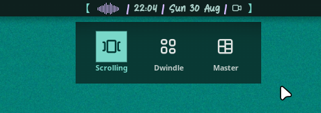

# Umbriel Layout

A Noctalia bar widget that opens a panel for switching [Umbriel](https://github.com/noctalia-dev/umbriel) window manager layouts.



## Requirements
- [`umbriel`](https://github.com/noctalia-dev/umbriel) — window manager

## Usage
Click the bar widget or using IPC to open the layout switcher panel.

## Settings
| Setting | Type | Default | Description |
| --- | --- | --- | --- |
| `closeOnSelect` | `bool` | `false` | Closes the panel automatically after a layout is selected. |

## IPC

```sh
 noctalia msg panel-toggle yogaeru/umbriel_layout:panel
```